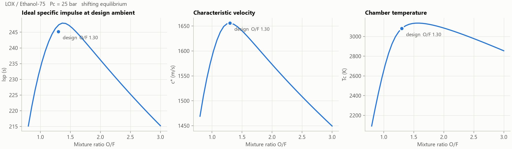
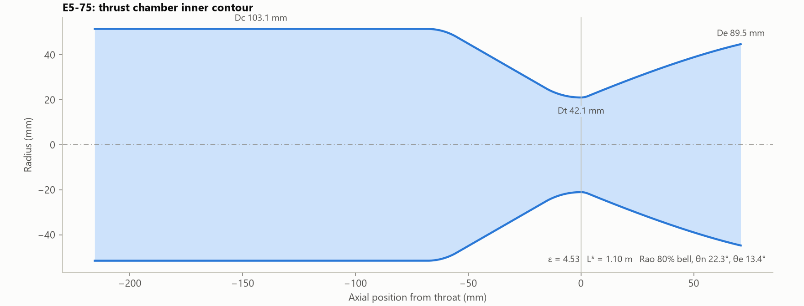
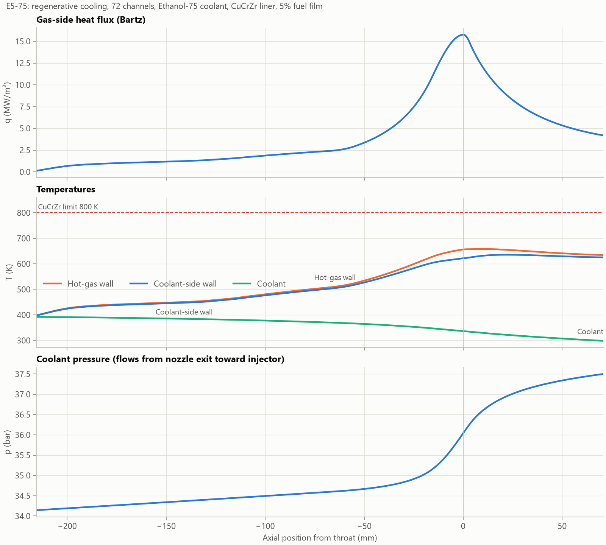
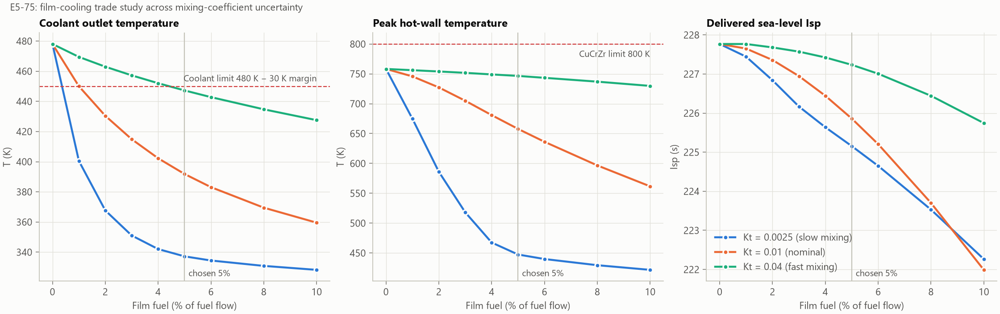
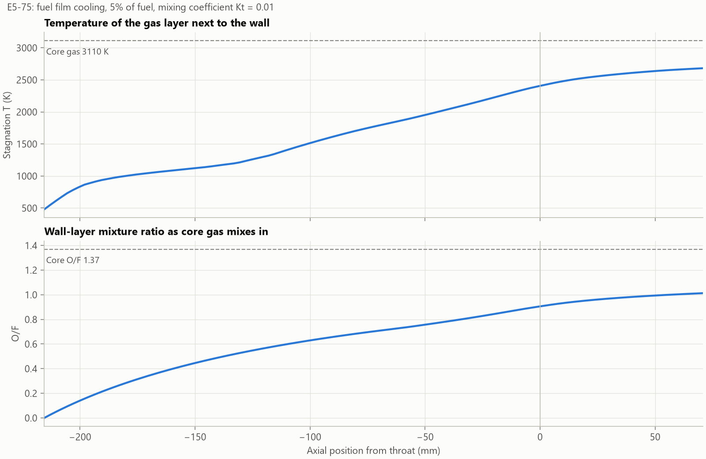

# Liquid Rocket Engine Preliminary Design Tool

A Python toolkit that takes top-level requirements (thrust, chamber pressure,
propellants) and produces a complete preliminary thrust-chamber design:
equilibrium combustion performance, chamber and bell-nozzle geometry,
injector orifice sizing, and a 1-D regenerative cooling analysis with fuel
film cooling.

The combustion solver is validated against published reference data (see
[Validation](#validation)) and every physical relation is covered by tests.

## Example: E5-75, a 5 kN LOX / 75 % ethanol engine

`python examples/design_5kN_lox_ethanol.py` → [`outputs/E5-75/`](outputs/E5-75)

| Requirement | Value |
|---|---|
| Thrust (sea level) | 5.0 kN |
| Chamber pressure | 25 bar |
| Propellants | LOX / 75 % ethanol + 25 % water |
| Mixture ratio | 1.30 (fuel-rich of the 1.38 Isp peak, for cooling margin) |
| Efficiencies | η<sub>c\*</sub> = 0.94, η<sub>Cf</sub> = 0.98 |
| Cooling | Regenerative (all fuel) + 5 % of fuel as wall film |

| Result | Value |
|---|---|
| Chamber temperature (overall / core) | 3081 K / 3110 K |
| Isp, ideal / delivered (sea level) | 245.2 s / 225.9 s (incl. 0.8 % film penalty) |
| Isp, vacuum (ideal, no film) | 278.2 s |
| Total mass flow | 2.26 kg/s (1.28 ox, 0.98 fuel) |
| Throat / chamber / exit diameter | 42.1 / 103.1 / 89.5 mm |
| Area ratio | 4.53 |
| Overall length | 286 mm |
| Peak heat flux | 15.8 MW/m² |
| Peak hot-wall temperature | 658 K (CuCrZr limit 800 K) |
| Coolant temperature rise | 298 → 392 K |
| Coolant pressure drop | 3.4 bar |





### Cooling channel trade study

The first channel layout (40 channels × 2.0 mm deep) gave only 6 m/s coolant
velocity and a 1124 K hot wall, far above the copper-alloy limit. Sweeping channel
count, depth, rib width and wall thickness:

| Channels | Depth (mm) | Rib (mm) | Wall (mm) | Coolant v (m/s) | Hot wall (K) | Δp (bar) |
|---|---|---|---|---|---|---|
| 40 | 2.0 | 1.2 | 1.0 | 6.3 | 1124 | 0.1 |
| 40 | 1.0 | 1.2 | 1.0 | 12.6 | 985 | 0.9 |
| 60 | 1.0 | 1.0 | 0.8 | 14.7 | 858 | 1.3 |
| 60 | 0.8 | 1.0 | 0.8 | 18.4 | 827 | 2.3 |
| **72** | **0.8** | **1.0** | **0.7** | **22.0** | **758** | **3.1** |
| 80 | 0.7 | 0.9 | 0.7 | 25.1 | 725 | 4.6 |

72 channels was selected: it clears the wall limit with 42 K of margin while keeping
the minimum channel width (0.9 mm) manufacturable and the pressure drop modest.

That left one problem: with regenerative cooling alone, the coolant leaves at ~478 K,
right at the estimated boiling onset of the ethanol/water blend at this pressure.

### Film cooling trade study

To fix the coolant temperature, part of the fuel is injected along the wall as a
film. It forms a cool, fuel-rich layer that gradually mixes with the hot core gas
([`film.py`](engine_design/film.py)).

The mixing rate is set by a turbulent mixing coefficient K<sub>t</sub> that is not
known before hot-fire testing. The design therefore has to pass across a
**16× range of K<sub>t</sub>** (0.0025–0.04), not just at a nominal value
(`python examples/film_trade_study.py`):



| Film fuel | Coolant out, worst case | Hot wall, worst case | Isp penalty, worst case |
|---|---|---|---|
| 0 % | 478 K ✗ | 758 K | none |
| 3 % | 457 K ✗ | 752 K | 0.7 % |
| **5 %** | **447 K ✓** | **747 K ✓** | **1.1 %** |
| 8 % | 435 K ✓ | 737 K ✓ | 1.9 % |

**5 % film was selected**: the smallest fraction that keeps the coolant at least
30 K below boiling and the wall under its limit at every K<sub>t</sub> in the
range. At the nominal K<sub>t</sub> = 0.01, the hot wall drops from 758 K to
658 K and the regen heat load from 525 kW to 276 kW.



**Follow-up:** the film is sized as 32 × 0.31 mm orifices, which is hard to drill
reliably. A continuous film slot, or fewer, larger orifices with a splash ring,
should be used instead.

## Method

| Module | What it does |
|---|---|
| [`combustion.py`](engine_design/combustion.py) | Adiabatic HP equilibrium with Cantera + NASA thermo data, using liquid-propellant enthalpies. Isentropic expansion with shifting or frozen composition. The throat is found by maximising mass flux ρv, which avoids needing an equilibrium sound speed. The exit comes from area ratio or exit pressure. |
| [`nozzle.py`](engine_design/nozzle.py) | Chamber volume from L\*, a converging section (fillet, cone, 1.5 Rt arc), and a Rao thrust-optimised parabolic bell (0.382 Rt arc, then a quadratic Bézier between θn and θe). |
| [`injector.py`](engine_design/injector.py) | Unlike-doublet orifice sizing from ṁ = C<sub>d</sub>A√(2ρΔp), plus the spray resultant angle from the momentum balance. |
| [`cooling.py`](engine_design/cooling.py) | Bartz gas-side coefficient with the σ correction and recovery-factor adiabatic wall temperature. 1-D wall conduction. Dittus-Boelter coolant side with rib fin efficiency. Counterflow march of coolant energy and pressure (Blasius friction). |
| [`film.py`](engine_design/film.py) | Fuel film cooling as a two-stream model. Core gas is entrained into the wall layer at d(ṁ<sub>e</sub>)/ds = 2K<sub>t</sub>ṁ<sub>core</sub>/r. The layer's temperature is the equilibrium flame temperature at its local O/F, and Isp is the mass average of the core and wall streams. Sizing is iterated because the film penalty changes the throat size. |
| [`engine.py`](engine_design/engine.py) | Ties everything together: optional Isp-optimal O/F, delivered Isp = η<sub>c\*</sub>η<sub>Cf</sub>·Isp<sub>ideal</sub>, ṁ = F / (Isp g₀), A<sub>t</sub> = ṁ c\* / P<sub>c</sub>. |

## Validation

Ideal performance against Sutton & Biblarz, *Rocket Propulsion Elements*, Table 5-5
(P<sub>c</sub> = 1000 psia, optimum expansion to 1 atm, shifting equilibrium):

| Propellants | O/F | T<sub>c</sub> (K) ref / this | c\* (m/s) ref / this | Isp (s) ref / this |
|---|---|---|---|---|
| LOX / LH2 | 4.02 | 2999 / 2956 | 2386 / 2417 | 389 / 389.1 |
| LOX / RP-1 | 2.56 | 3676 / 3666 | 1799 / 1796 | 300 / 299.6 |
| LOX / CH4 | 3.21 | 3526 / 3526 | 1835 / 1855 | 311 / 309.2 |

Isp agrees within 0.6 %. T<sub>c</sub> and c\* agree within 1.5 %.

The tests (`pytest`) also check:
- the Mach–area relation against tabulated values
- that the contour volume reproduces L\*·A<sub>t</sub>
- that the thrust equation closes both ways (ṁ·Isp·g₀ and C<sub>f</sub>·P<sub>c</sub>·A<sub>t</sub>)
- the orifice flow round trip
- that the coolant energy balance matches the integrated wall heat load
- film cooling behaviour: the wall-layer O/F starts at zero and rises monotonically without exceeding the core O/F; film lowers wall temperature at an Isp cost; faster mixing weakens the film

## Limitations

This is a preliminary-design tool. Known simplifications:
- The Rao angles θn and θe are read from charts to about ±1°. A method-of-characteristics contour is planned.
- Bartz generally over-predicts throat heat flux for small engines, which makes these results conservative.
- The model leaves out radiation, soot or carbon deposits, and axial conduction in the wall.
- The film mixing coefficient K<sub>t</sub> is an assumed parameter, which is why the design is checked across a 16× range. The film is treated as immediately vaporised. Below O/F 0.1, the wall-layer temperature is interpolated linearly to the fuel's boiling point. The product species do not include condensed carbon (soot).
- The coolant is modelled as single-phase with constant properties except viscosity. Boiling and supercritical behaviour are not modelled.
- Combustion efficiency and nozzle efficiency are user inputs, not predicted.

## Setup

```
python -m venv .venv
.venv\Scripts\activate
pip install -r requirements.txt
python examples/design_5kN_lox_ethanol.py
python examples/film_trade_study.py
pytest
```
